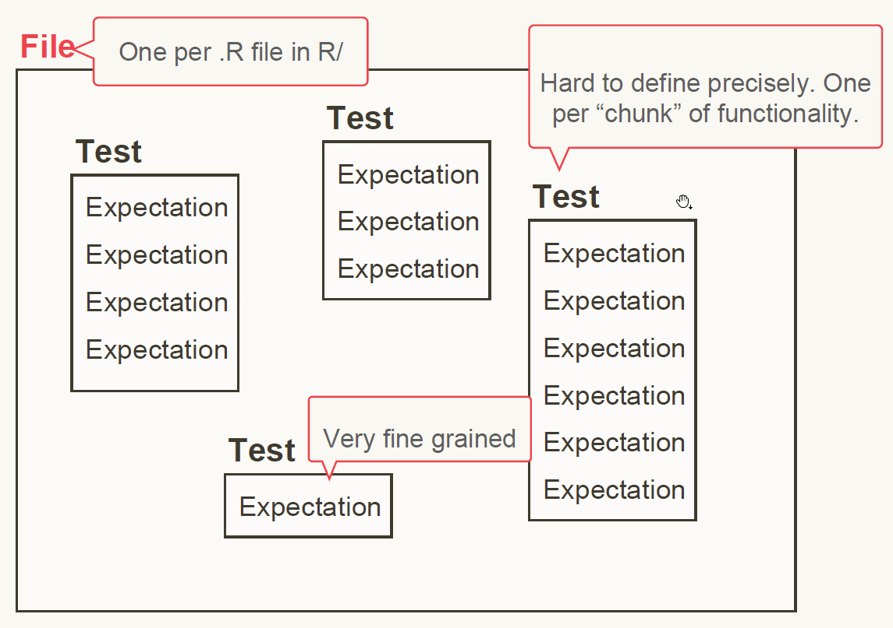
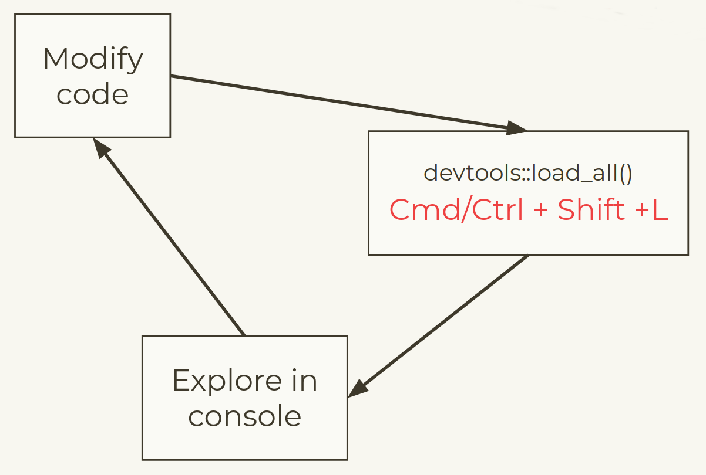
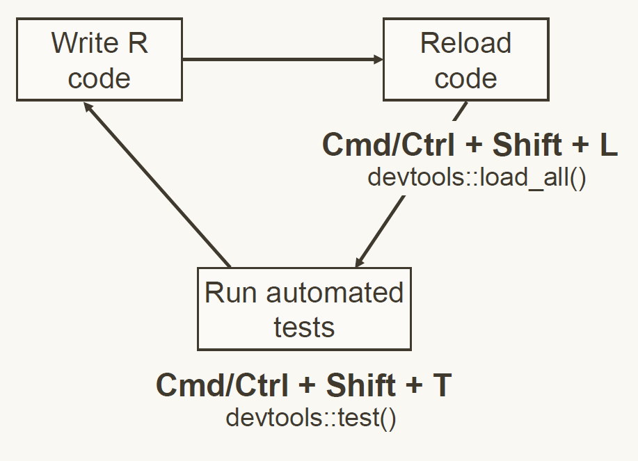

## Overview

- Packaging data
- Unit testing with **testthat**
- Test driven development

# Packaging data {.inverse}

## Including data

There are 3 types of data we might want to include:

- Exported data for the user to access: put in `/data`
- Internal data for functions to access: put in `/R/sysdata.rda`
- Raw data: put in `/inst/extdata`

## Exported data

The data should be saved in `/data` as an `.rda` (or `.RData`) file.

`usethis::use_data()` will do this for you, as well as a few other necessary steps:

```{r, eval = FALSE}
letter_indices <- data.frame(letter = letters, index = seq_along(letters))
usethis::use_data(letter_indices)
```

```
✔ Adding 'R' to Depends field in DESCRIPTION
✔ Creating 'data/'
✔ Setting LazyData to 'true' in 'DESCRIPTION'
✔ Saving 'letter_indices' to 'data/letter_indices.rda'
• Document your data (see 'https://r-pkgs.org/data.html')
```

. . .

:::{.callout-note}
For larger datasets, you can try changing the `compress` argument to get the best compression.
:::

## Provenance

Often the data that you want to make accessible to the users is one you have created with an R script -- either from scratch or from a raw data set.

It's a good idea to put the R script and any corresponding raw data in `/data-raw`.

`usethis::use_data_raw("dataname")` will set this up:

 - Create `/data-raw`
 - Add `/data-raw/dataname.R` for you to add the code needed to create the data
 - Add `^data-raw$` to `.Rbuildignore` as it does not need to be included in the actual package.

You should add any raw data files (e.g. `.csv` files) to `/data-raw`.

## Documenting Data

Datasets in `/data` are always exported, so **must** be documented.

To document a dataset, we must have an `.R` script in `/R` that contains a Roxygen block above the name of the dataset.

As with functions, you can choose how to arrange this, e.g. in one combined `/R/data.R` or in a separate R file for each dataset.

## Example: letter_indices

```
#' Letters of the Roman Alphabet with Indices
#'
#' A dataset of lower-case letters of the Roman alphabet and their 
#' numeric index from a = 1 to z = 26.
#'
#' @format A data frame with 26 rows and 2 variables:
#' \describe{
#'   \item{letter}{The letter as a character string.}
#'   \item{index}{The corresponding numeric index.}
#' }
"letter_indices"
```

`#' @ examples` can be used here too.

## Data source

For collected data, the (original) source should be documented with `#' @source`.

This should either be a url, e.g.
```{r}
#| eval: false
#' @source \url{http://www.diamondse.info/}
```
(alternatively `\href{DiamondSearchEngine}{http://www.diamondse.info/}`), or a reference, e.g.

```{r, eval = FALSE}
#' @source Henderson and Velleman (1981), Building multiple  
#'  regression models interactively. *Biometrics*, **37**, 391–411.
```

## Internal data

Sometimes functions need access to reference data, e.g. constants or look-up tables, that don't need to be shared with users.

These objects should be saved in a single `R/sysdata.rda` file.

This can be done with `use_data(..., internal = TRUE)`, e.g.

```{r, eval = FALSE}
x <- sample(1000)
usethis::use_data(x, mtcars, internal = TRUE)
```

The generating code and any raw data can be put in `/data-raw`.

As the objects are not exported, they don't need to be documented.

## Raw data

Sometimes you want to include raw data, to use in examples or vignettes.

These files can be any format and should be added directly into `/inst/extdata`.

When the package is installed, these files will be copied to the `extdata` directory and their path on your system can be found as follows:

```{r}
system.file("extdata", "mtcars.csv", package = "readr")
```

## Your turn

1. Run `usethis::use_data_raw("farm_animals")`.
2. In the script `data-raw/farm_animals.R` write some code to create a small data frame with the names of farm animals and the sound they make.
3. Run all the code (including the already-present call to `usethis::use_data()`) to create the data and save it in `/data`.
4. Add an `R/farm_animals.R` script and add some roxygen comments to document the data.
5. Run `devtools::document()` to create the documentation for the `farm_animals` data. Preview the documentation to check it.
6. Commit all the changes to your repo.


# Unit testing with testthat {.inverse}

## Why test?

We build new functions one bit at a time.

What if a new thing we add changes the existing functionality?

How can we check and be sure all the old functionality still works with New Fancy Feature?

Unit Tests!

::: {.notes}
Gives confidence to package users as well  
:::

## Set up test infrastructure

From the root of a package project:

```r
usethis::use_testthat()
```

```
✔ Adding 'testthat' to Suggests field in DESCRIPTION
✔ Setting Config/testthat/edition field in DESCRIPTION to '3'
✔ Creating 'tests/testthat/'
✔ Writing 'tests/testthat.R'
• Call `use_test()` to initialize a basic test file and open it for editing.
```

`tests/testthat.R` loads **testthat** and the package being tested, so you don't need to add `library()` calls to the test files.

## Tests are organised in three layers

{fig-align="center"}

::: {.notes}
A file holds multiple related tests.

A test groups together multiple expectations to test the output from a simple function, a range of possibilities for a single parameter from a more complicated function, or tightly related functionality from across multiple functions.

An expectation is the atom of testing. It describes the expected result of a computation: Does it have the right value and right class? 
:::

## What to test

Test every individual task the function completes separately.

Check both for successful situations and for expected failure situations.

## Expectations

Three expectations cover the vast majority of cases

```r
expect_equal(object, expected)

expect_error(object, regexp = NULL, class = NULL)

expect_warning(object, regexp = NULL, class = NULL)
```

:::{.notes}
It used to be standard practice to test for errors and warnings using regexp, but that has downsides - it's not always clear why a test is failing. Testing via class is a more modern, safer approach, which we'll use below.
:::

## Our example function

```{r}
animal_sounds <- function(animal, sound) {
  
  if (!rlang::is_character(animal, 1)) {
    cli::cli_abort("{.var animal} must be a single string!")
  }
  
  if (!rlang::is_character(sound, 1)) {
    cli::cli_abort("{.var sound} must be a single string!")
  }
  
  paste0("The ", animal, " goes ", sound, "!")
}
```

## Creating test files

First, create a test file for this function, in either way:

```{.r}
# In RStudio, with `animal_sounds.R` the active file:
usethis::use_test()  

# More generally
usethis::use_test("animal_sounds")
```

. . .

:::{.callout-note}
RStudio makes it really easy to swap between associated R scripts and tests.

If the R file is open, `usethis::use_test()` (with no arguments) opens or creates the test.

With the test file open, `usethis::use_r()` (with no arguments) opens or creates the R script.
:::

## Anatomy of a test

```{r}
#| eval: false
test_that(desc, code)
```

- `desc` is the test name. Should be brief and evocative, e.g. `test_that("multiplication works", { ... }).`
- `code` is test code containing expectations. Braces ({}) should always be used in order to get accurate location data for test failures.
  - can include several expectations, as well as other code to help define them

## Add a test

In the now-created and open `tests/testthat/test-animal_sounds.R` script:

```{r}
#| echo: false
#| message: false
library(testthat)
```


```{r}
#| eval: false
test_that("animal_sounds produces expected strings", {
  dog_woof <- animal_sounds("dog", "woof")
  expect_equal(dog_woof, "The dog goes woof!")
  expect_equal(animal_sounds("cat", "miaow"), "The cat goes miaow!")
})
```

## Run tests 

Tests can be run interactively like any other R code. The output will appear in the console, e.g. for a successful test:

```
Test passed 😀
```

Alternatively, we can run tests in the background with the output appearing in the build pane.

 - `testthat::test_file()` -- run all tests in a file ('Run Tests' button)
 - `devtools::test()` -- run all tests in a package (Ctrl/Cmd + Shift + T, or Build > Test Package)

## Testing equality

For numeric values, `expect_equal()` allows some tolerance:

```{r, error = TRUE}
expect_equal(10, 10 + 1e-7)
```

```{r, error = TRUE}
expect_equal(10, 10 + 1e-4, tolerance = 1e-4)
```

```{r, error = TRUE}
expect_equal(10, 10 + 1e-5)
```

Note that when the expectation is met, there is nothing printed.

. . . 

Use `expect_identical()` to test exact equivalence.

Use `expect_equal(ignore_attr = TRUE)` to ignore different attributes (e.g. names).

## `expect_error()`, `expect_warning()`

When we expect an error/warning when the code is run, we need to pass the call 
to `expect_error()`/`expect_warning()` directly. 

One way is to expect a text outcome using a regular expression:

```{r, eval = FALSE}
test_that("handles invalid inputs", {
    expect_error(animal_sounds("dog", c("woof", "bow wow wow")), 
                 "`sound` must be a single string")
})
```

However, the `regexp` can get fiddly, especially if there are characters to escape. There is a more modern, precise way...

::: {.notes}
have to call `animal_sounds` within `expect_error` - if we try calling it first (as we did in `expect_equal`) our code will throw an error before it has a chance to test for it!  
:::

## Using a condition `class`

When using `cli::cli_abort()` and `cli::cli_warn()` to throw errors and warnings, we can signal the condition with a `class`, which we can then use in our tests.

First, we need to modify the calls to `cli::cli_abort` in `animal_sounds()`

```{r}
#| eval: false
if (!rlang::is_character(sound, 1)) {
  cli::cli_abort(
    c("{.var sound} must be a single string!",
      "i" = "It was {.type {sound}} of length {length(sound)} instead."),
    class = "error_not_single_string"
  )
}

# and same for `animal` argument
```

## Using a condition's class in tests

We can then check for this class in the test

```{r, eval = FALSE}
test_that("handles invalid inputs", {
    expect_error(animal_sounds("dog", c("woof", "bow wow wow")), 
                 class = "error_not_single_string") 
})
```

Advantages of using `class`:

- It is under your control
- If the condition originates from base R or another package, proceed with caution -- a good reminder to re-consider the wisdom of testing a condition that is not fully under your control in the first place.

[From <https://r-pkgs.org/testing-basics.html#testing-errors>]{.smaller80}

::: {.notes}
Need to use argument name `class` as not matched by position (regexp comes before first)  
:::

## Your turn

1. Create a test file for `animal_sounds()` and add the tests defined in the 
slides.
2. Add a new expectation to the test "handles invalid inputs" to test the 
expected behaviour when a factor of length 1 is passed as the `sound` argument.
3. Run the updated test by sending the code chunk to the console.
4. Run all the tests.
5. Commit your changes to the repo.

::: {.notes}
animal_sounds(factor("cat"), "miaow")) 
:::

## Snapshot tests

Sometimes it is difficult to define the expected output, e.g. to test images or 
output printed to the console. `expect_snapshot()` captures all messages, warnings, errors, and output from code.

When we expect the code to throw an error (e.g. if we want to test the appearance of an informative message), we need to specify `error = TRUE`.

```{r, eval = FALSE}
test_that("error message for invalid input", {
  expect_snapshot(animal_sounds("dog", c("woof", "bow wow wow")),
                  error = TRUE)
})
```

Snapshot tests can not be run interactively by sending to the console, instead 
we must use `devtools::test()` or `testthat::test_file()`.

::: {.notes}
expect_error for testing that an error is thrown, expect_snapshot for testing the appearance of the error message

snapshot test skipped on CRAN by default - use other functions to test correctness where possible.

Equivalently Build menu "Test Package" or RStudio code editor "Run tests" button
:::

## Create snapshot

Run the tests once to create the snapshot

```
── Warning (test-animal_sounds.R:16:3): error message for invalid input ──
Adding new snapshot:
Code
  animal_sounds("dog", c("woof", "bow wow wow"))
Error <error_not_single_string>
  `sound` must be a single string!
  i It was a character vector of length 2 instead.
```

An `animal_sounds.md` file is created in `tests/testhat/_snaps` with the code 
and output.

## Test against a snapshot

:::{.smaller90}
Next time the tests are run the output will be compared against this snapshot.

Suppose we update an error message in `animal_sounds` to
```{r}
#| eval: false
"{.var sound} must be a {.cls character} vector of length 1!"
```

When we rerun the test, we'll get a failure:

```
── Failure (test-animal_sounds.R:16:3): error message for invalid input ──
Snapshot of code has changed:
old vs new
  "Code"
  "  animal_sounds(\"dog\", c(\"woof\", \"bow wow wow\"))"
  "Error <error_not_single_string>"
- "  `sound` must be a single string!"
+ "  `sound` must be a <character> vector of length 1!"
  "  i It was a character vector of length 2 instead."

* Run testthat::snapshot_accept('animal_sounds') to accept the change.
* Run testthat::snapshot_review('animal_sounds') to interactively review the change.
```
:::

::: {.notes}
Note the next steps with snapshot_accept and snapshot_review  
:::

## Snapshot tests for images

We can use `expect_snapshot_file()` to create snapshots for images. 
These allow us to compare binary outputs, though the can't provide an automatic diff when the test fails. Instead, call `snapshot_review()` to launch a Shiny app that allows you to visually review the changes.

See [Whole file snapshotting](https://testthat.r-lib.org/articles/snapshotting.html#whole-file-snapshotting) for further details.

The [vdiffr](https://vdiffr.r-lib.org) package allows comparisons between SVG images.

# Test driven development {.inverse}

## So far we've done this

{fig-align="center"}

## Test driven development is a new workflow

{fig-align="center"}

## Your turn

1. Make this test pass

   ```r
   giraffe <- animal_sounds("giraffe")
   expect_equal(giraffe, 
                "The giraffe makes no sound.")
   ```
   Hint: set the default value for the sound argument to `NULL`.
2. Commit your changes to the git repo.
3. Push your commits from this session.

## When you stop work, leave a test failing. {.inverse .center .center-h}

# Minute cards {.inverse}

- [Cohort 1](https://tally.so/r/LZa1Yp)
- [Cohort 2](https://tally.so/r/aQANEb)

# End matter {.inverse}

## References

Wickham, H and Bryan, J, _R Packages_ (2nd edn, in progress), <https://r-pkgs.org>.

R Core Team, _Writing R Extensions_, <https://cran.r-project.org/doc/manuals/r-release/R-exts.html>

## License

Licensed under a Creative Commons Attribution-NonCommercial-ShareAlike 4.0 International License ([CC BY-NC-SA 4.0](https://creativecommons.org/licenses/by-nc-sa/4.0/){target="_blank"}).
