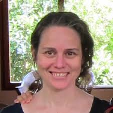

# Hello! {.inverse .center-h}

## Instructors

:::: {.columns}

::: {.column width="33%"}
### Joyce Robbins

{width=60%}

:::{.smaller80}
Senior Lecturer in Statistics

Columbia University
:::
:::

::: {.column width="33%"}
### Jesi Formoso

{width=60%}

:::{.smaller80}
Associate Researcher

University of Buenos Aires
:::
:::

::: {.column width="33%"}
### Heather Turner

{width=60%}

:::{.smaller80}
Principal RSE

University of Birmingham
:::

:::

::::

## Course material

- Website and slides 
  
  <https://forwards.github.io/package-dev>
  
- Website and slides repo

  <https://github.com/forwards/package-dev>
  
- Course text: R Packages (2nd edition), Hadley Wickham and Jennifer Bryan

  <https://r-pkgs.org>
  
## Schedule

Tuesdays, 14:30-16:00 UTC

:::{.smaller90}
| Module | Date | 
|----|----|
| [Package foundations](../modules/01-package-foundations/index.qmd) | May 20th |
| [Function documentation and dependencies](../modules/02-documentation/index.qmd) | June 3rd | 
| [Packaging data; Testing](../modules/03-data-testing/index.qmd) | June 17th | 
| [Package check and documentation](../modules/04-check-package-documentation/index.qmd) | July 1st | 
| [Publication and maintenance](../modules/05-publication-maintenance/index.qmd) | July 15th | 
:::

## Pieces of a puzzle

* In each module we will cover different elements of an R package
  * Think of this elements as pieces of a puzzle, you don't want to miss one! 
  * The course builds cumulatively
  
If you can't attend to a session, please follow the material and do the exersises to catch up before the next one. 

# Let's begin... {.inverse .center-h}

